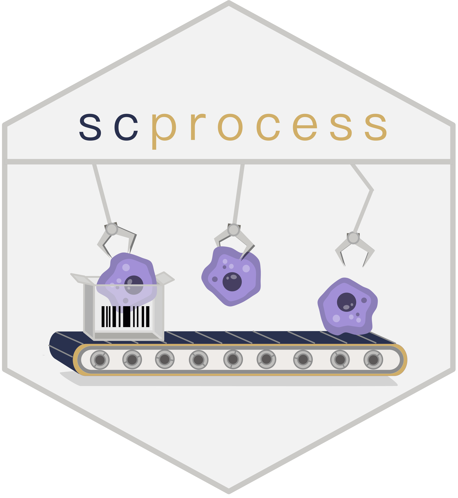
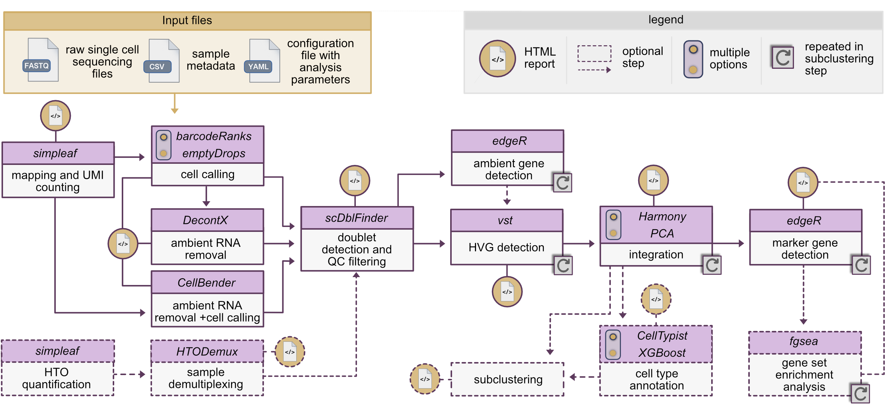

# scprocess 

`scprocess` is a Snakemake pipeline designed to streamline and automate processing of single cell RNA sequencing data. Optimized for data generated using the **10x Genomics** technology, it provides a comprehensive solution that transforms raw sequencing files into standardized outputs suitable for a variety of downstream tasks. The pipeline is built to support the analysis of datasets comprising multiple (i.e. 100+) samples via a simple CLI.

---

## Documentation & Tutorials
For detailed setup instructions, extended reference guides, and step-by-step tutorials on example datasets, please visit:

👉 **[https://macnairw.pages.roche.com/scprocess/](https://macnairw.pages.roche.com/scprocess/)**

---

## Features

`scprocess` consists of a series of core steps which can be performed in a single execution of the workflow. Additional steps are available to extend the core analyses as needed. 

Overview of scprocess including input file requirements, all pipeline steps and specific software packages/algorithms used.