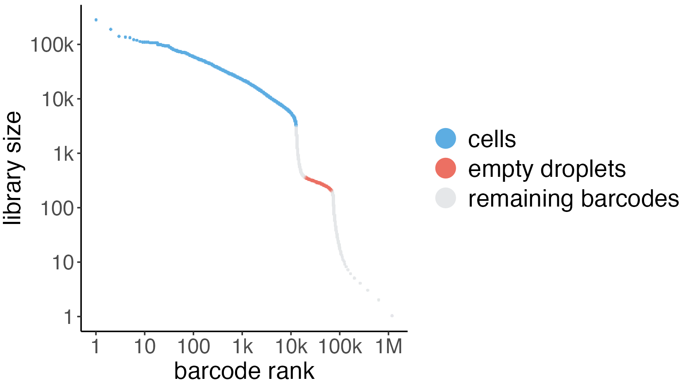

# Usage

## Basic usage

Considering required hardware is available, all software is installed and you have sucesfully completed the [setup of scprocess data directory](setup.md#scprocess-data-directory-setup) directory you can run {{ software_name }} on your dataset by following the steps outlined bellow:

1. [Prepare project directory](usage.md#1-prepare-project-directory)
2. [Prepare input files](usage.md#2-prepare-input-files)
3. [Prepare configuration file (config.yaml)](usage.md#3-prepare-configuration-file-configyaml)
4. [Run the analysis](usage.md#4-run-the-analysis)


### 1. Prepare project directory

{{ software_name }} relies on the ['Workflowr'](https://workflowr.github.io/workflowr/) project directory template. You can create a new `workflowr` project using:

```
newproj project_name -w /path/to/project/directory
```

### 2. Prepare input files

{{ software_name }} requires 2 types of input files:

* FASTQ files generated using 10x Genomics technology: names of FASTQ files have to contain a `[Sample ID]` in the name as well as `_R1_` an `_R2_` labels for read one (forward read) and read two (reverse read) respectievelly e.g.

    `[Sample ID]*_R1_*.fastq.gz` and `[Sample ID]*_R2_*.fastq.gz` where `*` can be replaced with any character.

* metadata: a CSV file with sample information. The only required column in the metadata file is `sample_id` with values matching `[Sample ID]` labels included in FASTQ file names.


### 3. Prepare configuration file (config.yaml)

{{ software_name }} requires a config.yaml where you can specify project parameters. This is an example of a configuration file with all [required parameters](reference.md#required-parameters).

```yaml
proj_dir: /path/to/proj/directory
fastq_dir: /path/to/directory/with/fastq/files
full_tag: test_project
short_tag: test
your_name: John Doe
affiliation: where you work
sample_metadata: /path/to/metadata.csv
species: human_2024
date_stamp: "2025-01-01"
```

### 4. Run the analysis

To run {{ software_name }} do:

```
scprocess /path/to/config.yaml
```

If you want to run a dry run you can add a `-n` or `--dry-run` flag to this command. In case you need to use other [snakemake options](https://snakemake.readthedocs.io/en/stable/executing/cli.html) that are not included in {{ software_name }}, you can use the `-E` or `--extraargs` flag. The argument of `-E` has to be between quotes. For example, if you would like to set a global maximum for the number of threads available to any rule you can use: 

```
scprocess /path/to/config.yaml -E " --max-threads 8 "
```

By default {{ software_name }} will run `rule all` which includes all 'core steps/rules' (point to introduction tab). The 'optional steps/rules' (`rule label_and_subset`, `rule zoom`, `rule pb_empties`) can run only after `rule all` is completed and have to be specifically requested. Additionally, you can run individual rules that generate HTML outputs (`run_alevin_fry`, `run_ambient`, `run_qc`, `run_integration`, `run_marker_genes`). This is useful if you want to inspect the html outputs first and then continue with the anylsis. can To run each rule separatelly you have to specify the rule using the `-r` or `--rule` flag e.g.

```
scprocess /path/to/config.yaml -r label_and_subset
```


## Best practices

The default parameters in the configuration file are suitable for running {{ software_name }} on the [example dataset](tutorial.md). Here are some of the most important things to consider when you are running {{ software_name }} on your own datset:

### Setting parameters for ambient contamination removal

#### Ambient method

By default {{ software_name }} scprocess will use `decontx` for ambient RNA removal which doesn't require GPU. If GPU is available we recommend using `cellbender` for ambient RNA decontamination as it was found to perform better than other related algorithms in [the lastest benchmark](https://genomebiology.biomedcentral.com/articles/10.1186/s13059-023-02978-x).

#### Knee parameters



Both algorithms for ambient RNA decontamination available in {{ software_name }} estimate background noise from empty droplets. Therefore, correctly identifying the subset of barcodes corresponding to empty droplets is critical. In the barcode-rank "knee plot," where barcodes are ranked in descending order based on their library size, two distinct plateaus are typically observed: the first plateau represents droplets containing cells with high RNA content, while the second corresponds to empty droplets containing ambient RNA.

{{ software_name }} identifies the cell-containing and empty droplet populations by detecting key transition points on the barcode-rank curve —namely, the inflection and knee points. These points allow {{ software_name }} to infer the optimal parameters for both `decontx` and `cellbender`. Additionally, {{ software_name }} uses these estimates in the optional pb_empties rule to identify genes enriched in empty droplets.

We recommend verifying the accuracy of these parameters by inspecting knee plots after running `simpleaf`. The two main parameters inferred by {{ software_name }} based on transition points in the barcode-rank curve are `expected_cells` and the `empty_pateau_line` (which corresponds to the `--total-droplets-included` parameter in `cellbender`). The `empty_pateau_line` should extend a few thousand barcodes into the second plateau.


To identify problematic samples, {{ software_name }} computes two diagnostic ratios:

* `expected_cells`/`empty_pateau_line` ratio: this helps assess whether the estimated number of cells is reasonable compared to the total barcodes included.
* `slope_ratio`: This is the ratio of the slope of the barcode-rank curve in the empty droplet region compared to the slope at the first inflection poin. Samples with a high slope ratio, as seen in 'Example 3,' are likely problematic because the empty droplet plateau is not clearly distinguishable. In such cases, ambient RNA contamination algorithms like `decontx` and `cellbender` may struggle to accurately estimate background noise, and we recommend considering removing these samples from further analysis.

If {{ software_name }} fails to estimate the knee plot parameters but the barcode-rank curve appears normal, we suggest manually adjusting the knee1, knee2, shin1, and shin2 parameters in the custom_sample_params file. A convenient way to fine-tune these parameters is by using the `plotKnee` function in {{ software_name }}. This function (which requires `plotly.express`, `packaging`, and .. whicha are not included with Snakemake) allows for easy visualization and adjustment of knee points.
    

### Setting QC parameters
    
### Managing resources


