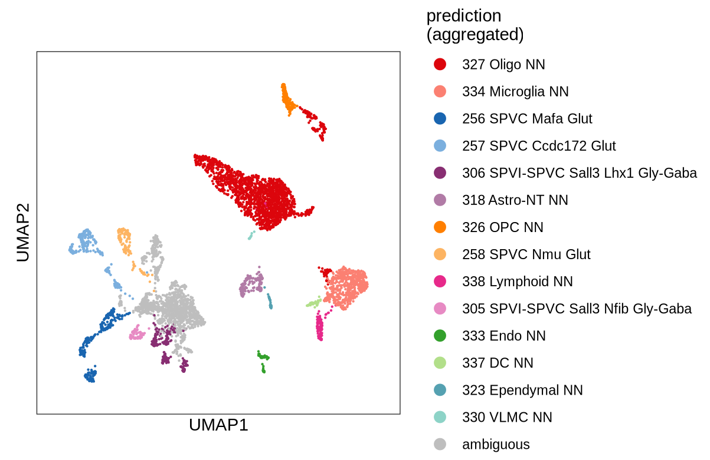

# Tutorials

In this section we will run {{sc}} on small example datasets. To be able to follow the tutorials make sure you completed all the steps in the [Getting started](setup.md) section.

## Tutorial 1: a basic workflow

A single nuclei dataset for this tutorial was generated by downsampling the data in this study: [BTK regulates microglial function and neuroinflammation in human stem cell models and mouse models of multiple sclerosis](https://www.nature.com/articles/s41467-024-54430-8).

??? Info "More about the tutorial dataset"

    This tutorial uses single nuclei RNA sequencing data from mouse spinal cord samples. The data comes from a study of the Experimental Autoimmune Encephalomyelitis (EAE) model of multiple sclerosis, which compared the effects of a Bruton's tyrosine kinase (BTK) inhibitor to a vehicle control. The raw data is available in Gene Expression Omnibus (GEO) under accession [GSE281176](https://www.ncbi.nlm.nih.gov/geo/query/acc.cgi?acc=GSE281176).

    We selected a subset of sequencing files from four different samples (GSM8612257 - SRR31256781, GSM8612258 - SRR31256780, GSM8612261 - SRR31256774, GSM8612262 - SRR31256771). 

    To generate smaller files via downsampling, we first processed the FASTQ files with Cell Ranger to generate BAM files. We then downsampled the BAM files by retaining 40% of the barcodes called as cells, 40% of barcodes in the empty plateau, and 30% of the remaining barcodes. Additionally, we discarded any barcodes with fewer than 10 unique molecular identifiers (UMIs) and all reads flagged as PCR duplicates. The filtered BAM files were then converted back to FASTQ format, resulting in the dataset used for this tutorial. For more information on the dataset creation process, please visit our github repository [link to code on github here].

### Creating a new project directory and preparing input data

First we will create a new project directory where all outputs of {{sc}} for this dataset will be stored:

```bash
# create a new directory called test_project in your current working directory
scprocess newproj test_project -s -c
# change your working directory to test_project
cd test_project
```

Using the command `tree .`, you can inspect the structure of the `test_project` directory:

```bash
.
├── _workflowr.yml
├── analysis
│   ├── _site.yml
│   ├── about.Rmd
│   ├── index.Rmd
│   └── license.Rmd
├── code
├── config-test_project.yaml
├── data
│   ├── fastqs
│   └── metadata
├── output
├── public
└── test_project.Rproj
```

In the `analysis/` directory, {{sc}} will store all R Markdown files that are used to create HTML reports in the `public/` directory. In the `code/` directory all R scripts used in {{sc}} will be stored.

For storing input FASTQ files and sample metadata for {{sc}} we will use the `data/fastqs` and `data/metadata` subdirectories, repectively.

To download input files for {{sc}} run the following lines: 

!!! warning "File size"
    
    The size of FASTQ files is approximately 7 GB. Download may take a while.

```bash
# download all raw sequencing files into data/fastqs
curl -s https://api.github.com/repos/marusakod/scprocessData/releases/tags/v0.1.4 \
| grep -o "https://.*GSM.*\.tar\.gz" \
| wget -c --show-progress -P data/fastqs -i -

# extract raw sequencing files
for file in data/fastqs/GSM*.tar.gz; do tar -xzvf "$file" -C data/fastqs && rm "$file"; done

# download sample metadata into data/metadata
wget -P data/metadata https://github.com/marusakod/scprocessData/releases/download/v0.1.4/test_project_metadata.csv
```

With `ls data/fastqs` you should be able to see the following files:

```bash
GSM8612257_SRR31256781_R1_.fastq.gz  GSM8612261_SRR31256774_R1_.fastq.gz
GSM8612257_SRR31256781_R2_.fastq.gz  GSM8612261_SRR31256774_R2_.fastq.gz
GSM8612258_SRR31256780_R1_.fastq.gz  GSM8612262_SRR31256771_R1_.fastq.gz
GSM8612258_SRR31256780_R2_.fastq.gz  GSM8612262_SRR31256771_R2_.fastq.gz
```

To inspect the contents of the `test_project_metadata.csv` file, you can use the following command:

```bash
cat data/metadata/test_project_metadata.csv | column -s, -t
```

This is what the output should look like:

```bash
sample_id               group          tissue
GSM8612257_SRR31256781  vehicle        spinal_cord
GSM8612258_SRR31256780  vehicle        spinal_cord
GSM8612261_SRR31256774  btk_inhibitor  spinal_cord
GSM8612262_SRR31256771  btk_inhibitor  spinal_cord
```

Note that the first column of the sample metadata file (`sample_id`) contains values that can be matched to FASTQ files.

### Creating a configuration file

The configuration file template `config-test_project.yaml` was created in the `test_project` root directory with the `newproj` function. In this file, all [required parameters](reference.md#required-parameters) for {{sc}} are listed, with some default values already set:

```yaml
project:
  proj_dir: /absolute/path/to/test_project # replace with correct absolute path 
  fastq_dir: data/fastqs
  full_tag: test_project
  short_tag: 
  sample_metadata: data/metadata/
  ref_txome:
  date_stamp: "2025-01-01"
```

In addition to setting values for the required parameters, we will include the optional `metadata_vars` and `custom_sets` parameters. The `metadata_vars` parameter allows us to specify additional metadata variables for visualization, while the `custom_sets` parameter enables us to provide a file containing a list of marker genes associated with different cell types expected in our dataset. In this case, we only need to specify the name of the marker gene file, as the corresponding file `mouse_brain.csv` already exists in the `$SCPROCESS_DATA_DIR/marker_genes` directory.

Note that `proj_dir` requires an absolute path, whereas `fastq_dir` and `sample_metadata` can use relative paths, since the raw data and sample metadata are stored within the project directory:

```yaml
project:
  proj_dir: /absolute/path/to/test_project # replace with correct absolute path 
  fastq_dir: data/fastqs
  full_tag: test_project
  short_tag: test
  sample_metadata: data/metadata/test_project_metadata.csv
  ref_txome: mouse_2024
  date_stamp: "2025-01-01"
  metadata_vars: [group]
marker_genes:
  mkr_custom_genesets:
    - name: mouse_brain
```

### Running {{sc}}

We are now ready to run {{scrun}} using:

```bash
scprocess run config-test_project.yaml
```

### Labelling cell types

??? warning "Tutorial results may vary from your {{sc}} outputs"
    
    If you modify the default settings for the `mouse_2024` genome in `.scprocess_setup.yaml`, the results you obtain from running {{sc}} on the tutorial dataset may differ slightly from those shown in this guide.

{{sc}} can automatically annotate cell types using various pretrained models. In this tutorial we will use the mouse whole brain classifier provided by CellTypist. To specify the annotation model, add the highlighed lines to your configuration file:

```yaml hl_lines="10 11 12"
project:
  proj_dir: /absolute/path/to/test_project # replace with correct absolute path 
  fastq_dir: data/fastqs
  full_tag: test_project
  short_tag: test
  sample_metadata: data/metadata/test_project_metadata.csv
  ref_txome: mouse_2024
  date_stamp: "2025-01-01"
  metadata_vars: [group]
label_celltypes:
  - labeller: "celltypist"
    model: Mouse_Whole_Brain
```

Cell type annotation can now be initiated using the following command:

```bash
scprocess run config-test_project.yaml -r label_celltypes
```

### Zooming in 

After label asignment, we can subcluster populations of interest using {{sc}}. To identidy those populations we can inspect the `test_label_celltypes.html` report which should be located in the `public` directory.

The report includes a UMAP plot displaying the predicted cell type annotations:



In this example, we will subcluster the populations labelled "327 Oligo NN" (oligodendrocytes) and "326 OPC NN" (oligodendrocyte precursor cells). 

1. Create a Subclustering configuration file
    
    First, create a new configuration file named `zoom_params_test_project-oligos_opcs.yaml`, with the following parameters: 

    ```yaml
    zoom:
      name: oligos_opcs
      labels_source: celltypist
      model: Mouse_Whole_Brain
      sel_labels: ["327 Oligo NN", "326 OPC NN"]
      labels_col: predicted_label_agg
    ```

    The value of the `labels_source` parameter matches the value of the `labeller` parameter in the main configuration file. The `sel_labels` parameter lists specific clusters/cell types to include in subclustering. `labels_col` referes to a column name in the annotation output file [path to file here] containg cell type names.

2. Link Subclustering configuration file to main project
    
    Link the subclustering YAML to your main project configuration file by (`config-test_project.yaml`) by adding it to the `zoom` section:

    ```yaml hl_lines="15 16"
    project:
      proj_dir: /absolute/path/to/test_project # replace with correct absolute path 
      fastq_dir: data/fastqs
      full_tag: test_project
      short_tag: test
      your_name: Test McUser
      affiliation: Unemployed
      sample_metadata: data/metadata/test_project_metadata.csv
      ref_txome: mouse_2024
      date_stamp: "2025-01-01"
      metadata_vars: [group]
    label_celltypes:
      - labeller: "celltypist"
        model: Mouse_Whole_Brain
    zoom:
      - zoom_params_test_project-oligos_opcs.yaml
    ```

3. Run subclustering
    
    To run subclustering use the following command:

    ```bash
    scprocess run config-test_project.yaml -r zoom
    ```


## Tutorial 2: Analysis of multiplexed single cell data

A single cell dataset for this tutorial was generated by downsampling the data in this study: [The coenzyme A precursor pantethine enhances antitumor immunity in sarcoma](https://www.life-science-alliance.org/content/6/12/e202302200). The dataset includes samples representing four distinct experimental groups, with one replicate from each group combined into a single pooled (multiplexed) sample.

??? Info "More about the tutorial dataset"

    This tutorial uses single cell RNA sequencing data from mouse tumor samples. The data was generated in a study where MCA205 mouse fibrosarcoma cells were injected subcutaneously into C57BL/6 mice. Ten days after engraftment, the mice were treated with either pantethine (a vitamin B5 precursor) or PBS (vehicle control). Tumors were harvested at 20 and 28 days post-engraftment, and CD45+ immune cells were isolated for single-cell RNA sequencing. The raw data is available in Gene Expression Omnibus (GEO) under accession [GSE221164](https://www.ncbi.nlm.nih.gov/geo/query/acc.cgi?acc=GSE221164).

    We selected sequencing files from two multiplexed samples, including both gene expression and all associated HTO FASTQ files. The GEO sample accession numbers and their corresponding sequencing run identifiers are as follows: (1) gene expression: GSM6846850 (SRR22767531), HTO: GSM6846851; and (2) gene expression: GSM6846854 (SRR22767514), HTO: GSM6846855.

    To generate smaller gene expression files via downsampling, we first processed the FASTQ files with Cell Ranger to generate BAM files. We then downsampled the BAM files by retaining 50% of the barcodes called as cells, 70% of barcodes in the empty plateau, and 70% of the remaining barcodes. Additionally, we discarded any barcodes with fewer than 10 unique molecular identifiers (UMIs) and all reads flagged as PCR duplicates. The filtered BAM files were then converted back to FASTQ format, resulting in the dataset used for this tutorial. For more information on the dataset creation process, please visit our github repository [link to code on github here].

### Creating a new project directory and preparing input data

First we will create a new project directory where all outputs of {{sc}} will be stored:

```bash
# create a new directory called test_project in your current working directory
scprocess newproj test_multiplexed_project  -s -c
# change your working directory to test_project
cd test_multiplexed_project
```

We will use the `data/metadata` directory to store the sample metadata file. Additionally, a feature reference file will also be downloaded into the same directory. Input FASTQ files will be stored in the `data/fastqs` directory, with two subdirectories: `data/fastqs/rna` for storing gene expression FASTQ files and `data/fastqs/hto` for storing HTO FASTQ files.

To create the directories for FASTQ files, use:

```bash
mkdir data/fastqs/rna
mkdir data/fastqs/hto
```

To download input files for {{sc}} run the following lines: 

!!! warning "File size"
    
    The size of FASTQ files is approximately 4 GB. Download may take a while.

```bash
# download all raw sequencing files into data/fastqs
curl -s https://api.github.com/repos/marusakod/scprocessData/releases/tags/v0.1.4 \
| grep -o "https://.*run.*\.tar\.gz" \
| wget -c --show-progress -P data/fastqs -i -

# extract gene expression sequening files
for file in data/fastqs/run*_rna*.tar.gz; do tar -xzvf "$file" -C data/fastqs/rna && rm "$file"; done

# extract HTO sequencing files
for file in data/fastqs/run*_hto*.tar.gz; do tar -xzvf "$file" -C data/fastqs/hto && rm "$file"; done

# download sample metadata into data/metadata
wget -P data/metadata https://github.com/marusakod/scprocessData/releases/download/v0.1.4/multiplexed_test_project_metadata.csv

# dowload feature reference file into data/metadata
wget -P data/metadata https://github.com/marusakod/scprocessData/releases/download/v0.1.4/multiplexed_test_project_feature_ref.csv
```

With `ls data/fastqs/rna` you should be able to see the following files:

``` bash
run1_rna_R1_.fastq.gz  run1_rna_R2_.fastq.gz  run2_rna_R1_.fastq.gz  run2_rna_R2_.fastq.gz
```
With `ls data/fastqs/hto` you should be able to see the following files:

```bash
run1_hto1_R1_.fastq.gz  run1_hto3_R1_.fastq.gz  run2_hto1_R1_.fastq.gz  run2_hto3_R1_.fastq.gz
run1_hto1_R2_.fastq.gz  run1_hto3_R2_.fastq.gz  run2_hto1_R2_.fastq.gz  run2_hto3_R2_.fastq.gz
run1_hto2_R1_.fastq.gz  run1_hto4_R1_.fastq.gz  run2_hto2_R1_.fastq.gz  run2_hto4_R1_.fastq.gz
run1_hto2_R2_.fastq.gz  run1_hto4_R2_.fastq.gz  run2_hto2_R2_.fastq.gz  run2_hto4_R2_.fastq.gz
```

To inspect the contents of the `multiplexed_test_project_metadata.csv` file, you can use the following command:

```bash
cat data/metadata/multiplexed_test_project_metadata.csv | column -s, -t
```

This is what the output should look like:

```bash
pool_id  sample_id     hto_id                   day  treatment
run1     D21_PBS_R1    totalseq_B0301_hashtag1  21   PBS
run1     D21_Panth_R1  totalseq_B0302_hashtag2  21   pantethine
run1     D29_PBS_R1    totalseq_B0303_hashtag3  29   PBS
run1     D29_Panth_R1  totalseq_B0304_hashtag4  29   pantethine
run2     D21_PBS_R2    totalseq_B0301_hashtag1  21   PBS
run2     D21_Panth_R2  totalseq_B0302_hashtag2  21   pantethine
run2     D29_PBS_R2    totalseq_B0303_hashtag3  29   PBS
run2     D29_Panth_R2  totalseq_B0304_hashtag4  29   pantethine
```

Note that the first column of the sample metadata file (`pool_id`) contains values that can be matched to both gene expression and HTO FASTQ files i.e. `run*`. The metadata file requires two additional columns:

* `sample_id`: Lists all samples corresponding to a single pool.
* `hto_id`: Lists the names of HTO tags used to label each sample.

The `hto_id` column must correspond to a column in the feature reference file, which links the name of each HTO tag to its sequence.

To see the contents of the feature reference file use 

```bash
cat data/metadata/multiplexed_test_project_feature_ref.csv | column -s, -t
```

```bash
hto_id                   sequence
totalseq_B0301_hashtag1  ACCCACCAGTAAGAC
totalseq_B0302_hashtag2  GGTCGAGAGCATTCA
totalseq_B0303_hashtag3  CTTGCCGCATGTCAT
totalseq_B0304_hashtag4  AAAGCATTCTTCACG
```

### Creating a configuration file

The configuration file template `config-test_multiplexed_project.yaml` was created in the `test_multiplexed_project` root directory with the `newproj` function. In this file, all [required parameters](reference.md#required-parameters) for {{sc}} are listed, with some default values already set:

```yaml
project:
  proj_dir: /absolute/path/to/test_multiplexed_project
  fastq_dir: data/fastqs
  full_tag: test_multiplexed_project
  short_tag:
  your_name:
  affiliation:
  sample_metadata: data/metadata/
  ref_txome:
  date_stamp: "2025-08-19"
```

In addition to setting the parameters already present in the template configuration file, we must also define additional parameters specific to the multiplexed nature of the dataset. These key parameters are highlighted below:

```yaml hl_lines="12 13 14 15"
project:
  proj_dir: /absolute/path/to/test_multiplexed_project
  fastq_dir: data/fastqs/rna
  full_tag: test_multiplexed_project
  short_tag: test
  your_name: Test McUser
  affiliation: Unemployed
  sample_metadata: data/metadata/multiplexed_test_project_metadata.csv
  ref_txome: mouse_2024
  date_stamp: "2025-01-01"
multiplexing:
  demux_type: hto
  fastq_dir: data/fastqs/hto
  feature_ref: data/metadata/multiplexed_test_project_feature_ref.csv
qc:
  qc_min_cells: 100
  qc_max_mito: 0.05
  qc_min_splice: 0.5
  qc_max_splice: 0.9
```

Setting `demux_type` to `hto` instructs {{sc}} to use HTO-based demultiplexing for this dataset. By specifying `fastq_dir` and `feature_ref`, we provide {{sc}} with the paths to the HTO FASTQ files and the feature reference file, respectively. 

Note that this is a downsampled dataset with a limited number of cells. To ensure that all samples with at least 100 cells remaining after QC filtering are retained, we set the `qc_min_cells` parameter to 100. Since this is a single-cell dataset, we also adjust the spliced proportion thresholds to refine cell selection. Specifically, we set `qc_min_splice` to 0.5 to exclude cells with less than 50% spliced reads, as these are likely nuclei, and `qc_max_splice` to 0.9 to exclude cells with more than 90% spliced reads, which likely indicates substantial cytoplasmic contamination.

### Running {{sc}}

We are now ready to run {{scrun}} using:

```bash
scprocess run config-test_multiplexed_project.yaml
```


<!-- citations -->
<!-- [Link to paper]() -->

[^1]: Marques, S., et al. Oligodendrocyte heterogeneity in the mouse juvenile and adult central nervous system. Science. 2016;352(6291):1326-1329. [Link to paper](https://www.science.org/doi/10.1126/science.aaf6463).


